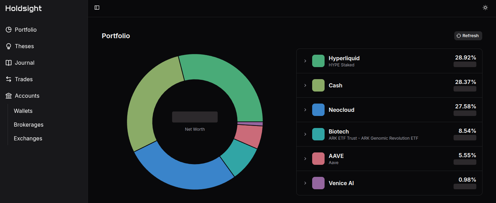
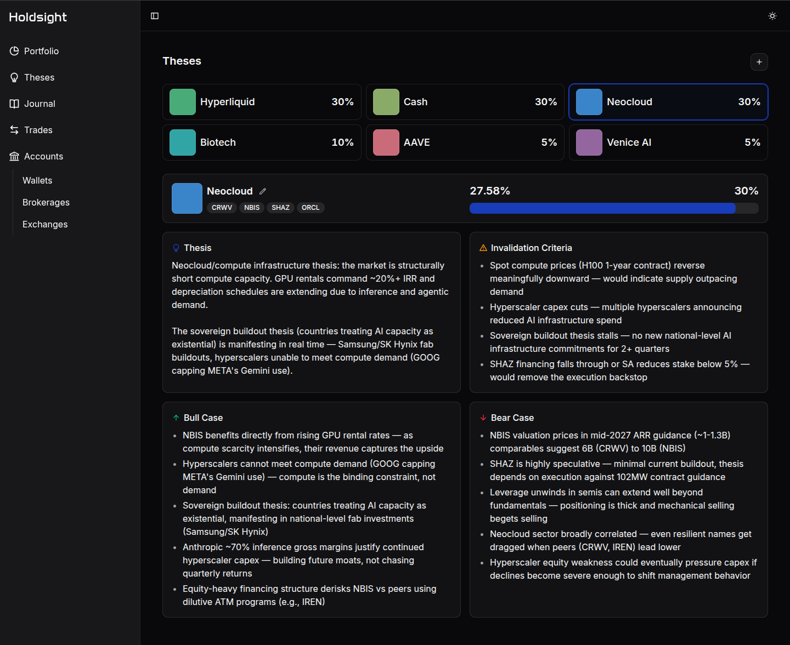
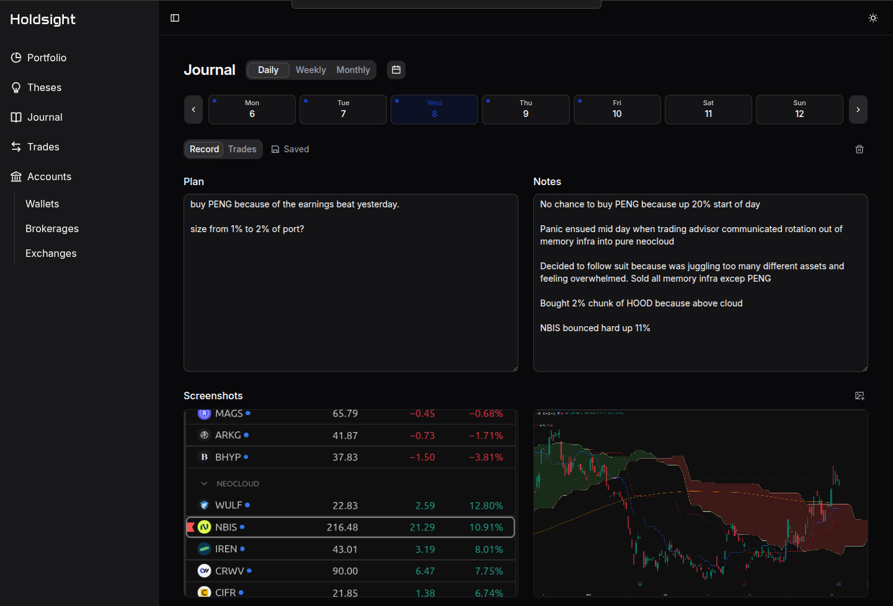

# HoldSight

HoldSight connects portfolio activity, investment theses, and reflection so investors can better understand their decisions.

## What it does

- Consolidates holdings and allocations across connected financial accounts
- Tracks investment theses, targets, risks, and invalidation criteria
- Syncs trades into a searchable activity history
- Structures daily, weekly, and monthly planning and reflection

## Theses

Define an investment case, compare target and current allocations, and record what would prove the thesis wrong.

## Journal

Connect portfolio activity to plans and reflections across daily, weekly, and monthly review cycles.

## Built with

Next.js, TypeScript, Tailwind CSS, shadcn/ui, Neon Postgres, Drizzle ORM, Better Auth, Plaid, and Recharts.
